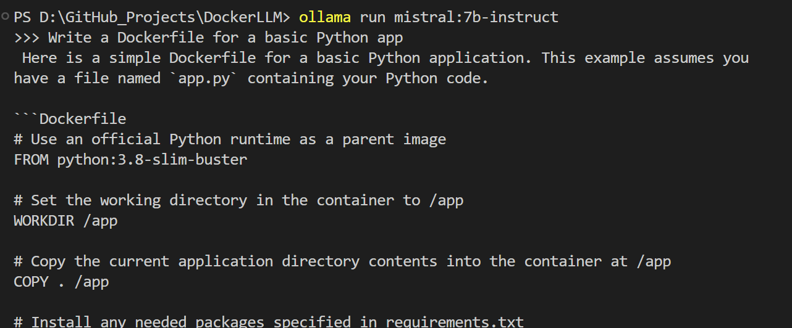
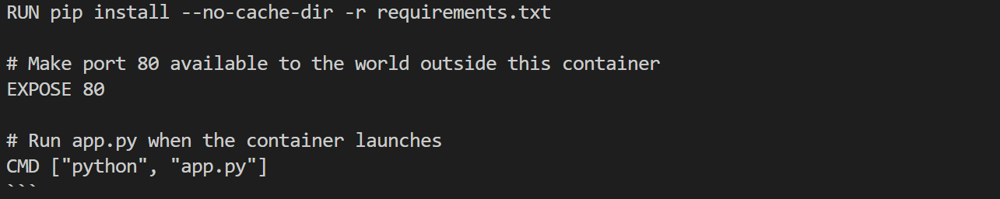
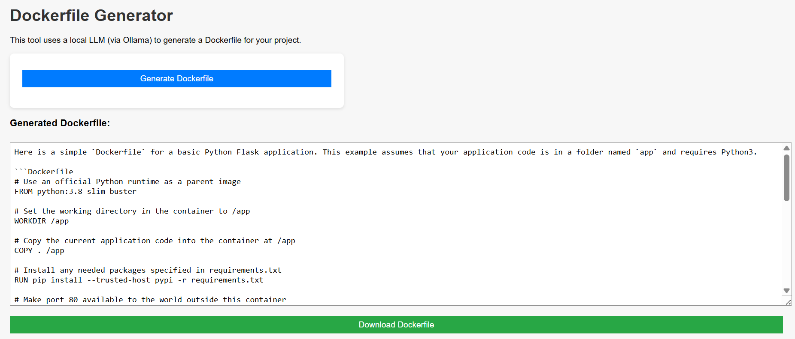
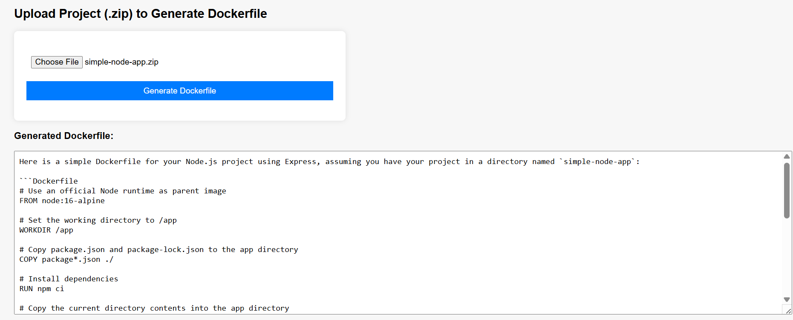

# Dockerfile Generator using Flask + Ollama + CodeLLaMA

This project is a lightweight Flask-based REST API that generates Dockerfiles using a local open-source LLM (CodeLLaMA-7B-Instruct) via [Ollama](https://ollama.com/).

---

## Features

- REST API built with Flask
- Uses open-source LLM (CodeLLaMA) via Ollama (no API key required)
- Generates Dockerfiles from simple natural language prompts
- Secure and offline (no OpenAI or Hugging Face APIs required)
- Tested with Postman

---

## Getting Started

### Prerequisites

- Python 3.8+
- [Ollama](https://ollama.com) installed and running
- VS Code

---

## Phase 1 - Working with Prompt in CLI and Postman

A simple prompt ("Write a Dockerfile for a basic Python app"), the LLM will generate a ready-to-use Dockerfile.

### Setup Instructions

1. **Install Python dependencies**

```bash
pip install flask requests python-dotenv
```

2. **Start Ollama and Pull the Model**

```bash
ollama run codellama:7b-instruct
```

3. **Run Ollama in server mode**

```bash
ollama serve
```

4. **Run the Flask App**

```bash
python app.py
```

5. **Test with Postman**

```bash
http://127.0.0.1:5000/generate-dockerfile
```

6. **JSON Body Example**

```bash
{
"language": "python",
"framework": "flask",
"port": "5000"
}
```

7. **Dockerfile generation by manually working with LLM on CLI**




## Phase 2 - Working with Prompt in UI (HTML&JS)

- Generate a basic Dockerfile for a Python project using Flask, using a local LLM (like `mistral:7b-instruct`)
- Interface includes a simple frontend built with HTML and JavaScript
- LLM inference is streamed and parsed in real-time
- Dockerfile is displayed on-screen and can be downloaded



## Phase 3 - Generating Dockerfile wih uploads like requirements/package.json

Allows users to upload a `.zip` file of their application (Python/Node.js), and automatically generates a Dockerfile using a locally hosted open-source LLM (like Mistral) via Ollama.

## Features

- Upload a `.zip` file containing source code (Python or Node.js)
- Extracts and analyzes `requirements.txt` or `package.json`
- Uses a locally running LLM (e.g., Mistral via Ollama) to generate a Dockerfile
- Simple frontend built with HTML + JavaScript
- Fully local — no OpenAI API needed

## How It Works

1. User uploads `.zip` file of their project.
2. Flask backend extracts the zip.
3. Scans for key files like:
   - `requirements.txt` (Python)
   - `package.json` (Node.js)
4. Constructs a prompt using the content of those files.
5. Sends the prompt to a local LLM using Ollama.
6. LLM generates the Dockerfile, which is displayed in the UI.



## Phase 4 - Automating Docker Image Build & Security Scan with GitHub Actions
